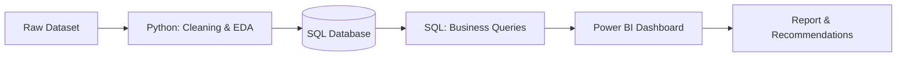

<div align="center">

# 🛍️ Customer Behavior Analysis

### End-to-end data analytics workflow: Python • SQL • Power BI

<p>
  
  
  
  
  
</p>
<p>
  
  
  
  
</p>

</div>

---

## 📌 Project Overview

This project is a complete, end-to-end data analytics workflow that mirrors the responsibilities of a professional analyst in a modern business environment. It covers every critical stage: **data preparation, modeling, SQL analysis, visualization, and reporting**, turning raw customer data into actionable business intelligence.

The goal is to understand **customer purchasing behavior, segments, loyalty patterns and purchase drivers**, so stakeholders can make data-driven decisions.

### 🎯 What this project demonstrates

| Stage | Tool | What was done |
|-------|------|---------------|
| 🧹 **Data Preparation & EDA** | Python (Pandas) | Cleaned and transformed the raw dataset, explored patterns |
| 🗄️ **Data Analysis** | SQL (PostgreSQL) | Loaded data into a database and ran queries on customer segments, loyalty and purchase drivers |
| 📊 **Visualization & Insights** | Power BI | Built an interactive dashboard highlighting key trends |
| 📝 **Reporting** | Report & Presentation | Summarized findings and business recommendations |

---

## 🔄 Project Workflow



---

## 🛠️ Tech Stack

| Category | Tools |
|----------|-------|
| **Language** | Python, SQL |
| **Libraries** | Pandas, NumPy |
| **Database** | PostgreSQL |
| **Visualization** | Power BI |
| **Environment** | Jupyter Notebook |

---

## 📁 Repository Structure

```
Customer_behavior_analysis/
│
├── README.md
├── Customer_Shopping_Behavior_Analysis.ipynb   # Data import, exploration, cleaning, SQL loading
├── customer_behavior_sql_queries.sql           # Business questions answered with SQL
└── customer_behavior_dashboard.pbix            # Interactive Power BI dashboard
```

---

## 🔍 Business Questions Explored

Using SQL, the analysis answers questions such as:

- 👥 Which **customer segments** contribute the most to revenue?
- 🔁 How does **purchase frequency** relate to customer loyalty?
- 💰 What factors **drive purchase value**?
- 🛒 Which **product categories** perform best?
- 📅 Are there noticeable **seasonal or behavioral trends**?


---

## 🚀 How to Use This Project

### 1️⃣ Clone the repository

```bash
git clone https://github.com/ruchitasingla/Customer_behavior_analysis.git
cd Customer_behavior_analysis
```

### 2️⃣ Run the Python notebook

Open `Customer_Shopping_Behavior_Analysis.ipynb`. It covers:

- Data import
- Data exploration
- Data cleaning
- Connection to the SQL database and loading the cleaned data

```bash
pip install pandas numpy sqlalchemy psycopg2-binary jupyter
jupyter notebook
```

### 3️⃣ Set up the SQL database

1. Create a database in PostgreSQL (MySQL or MS SQL Server also work)
2. Update the connection details in the notebook
3. Run the notebook's loading code to push the cleaned data into the database

### 4️⃣ Run the SQL analysis

Open `customer_behavior_sql_queries.sql` and run the queries to answer the business questions.

### 5️⃣ Explore the dashboard

1. Connect Power BI to your SQL database
2. Open `customer_behavior_dashboard.pbix`
3. Refresh the data and explore the interactive visuals

---

## 👩‍💻 Author

**Ruchita Singla**

<a href="https://www.linkedin.com/in/ruchita-singla/">
  
</a>
<a href="https://github.com/ruchitasingla">
  
</a>
<a href="mailto:ruchitasingla001@gmail.com">
  
</a>

---

<div align="center">

⭐ If you found this project useful, consider giving it a star!

</div>
